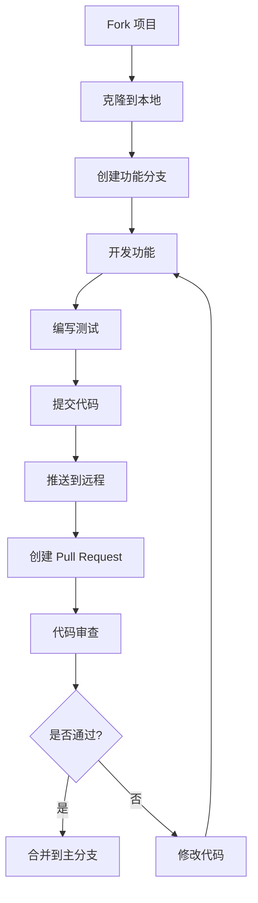

# 贡献指南

感谢你对 OpenLedger 项目的关注！我们欢迎所有形式的贡献，无论是代码、文档、设计还是建议。

## 📋 目录

- [行为准则](#行为准则)
- [如何贡献](#如何贡献)
- [开发环境](#开发环境)
- [代码规范](#代码规范)
- [提交规范](#提交规范)
- [Pull Request 流程](#pull-request-流程)
- [Bug 报告](#bug-报告)
- [功能请求](#功能请求)
- [文档贡献](#文档贡献)
- [社区参与](#社区参与)

## 行为准则

本项目采用 [Contributor Covenant 行为准则](CODE_OF_CONDUCT.md)。参与本项目即表示你同意遵守该准则。

### 我们的承诺

- 营造开放、友好、包容的环境
- 尊重不同观点和经验
- 接受建设性批评
- 关注对社区最有利的事情
- 对其他社区成员表示同理心

### 不可接受的行为

- 使用性暗示的语言或图像
- 恶意评论或人身攻击
- 公开或私下骚扰
- 未经许可发布他人私人信息
- 其他不道德或不专业的行为

## 如何贡献

### 贡献方式

1. **代码贡献**: 修复 Bug、添加新功能、优化性能
2. **文档贡献**: 完善文档、修复错误、添加示例
3. **设计贡献**: UI/UX 设计、图标设计、动画设计
4. **测试贡献**: 编写测试、报告 Bug、验证修复
5. **翻译贡献**: 翻译界面、文档本地化
6. **社区参与**: 回答问题、参与讨论、分享经验

### 贡献流程



## 开发环境

### 环境要求

- **Android Studio**: Hedgehog (2023.1.1) 或更高版本
- **JDK**: 17 或更高版本
- **Android SDK**: 34
- **Kotlin**: 1.9.0 或更高版本
- **Git**: 2.30.0 或更高版本

### 环境配置

#### 1. 安装 Android Studio

1. 下载 [Android Studio](https://developer.android.com/studio)
2. 安装并启动 Android Studio
3. 配置 Android SDK 和模拟器

#### 2. 配置 JDK

```bash
# 检查 Java 版本
java -version

# 如果需要，安装 JDK 17
# macOS (使用 Homebrew)
brew install openjdk@17

# Ubuntu/Debian
sudo apt install openjdk-17-jdk

# Windows (使用 Chocolatey)
choco install openjdk17
```

#### 3. 克隆项目

```bash
# 克隆项目
git clone https://github.com/gushanaobai/OpenLedger.git

# 进入项目目录
cd OpenLedger

# 添加上游远程仓库
git remote add upstream https://github.com/gushanaobai/OpenLedger.git
```

#### 4. 构建项目

```bash
# 构建 Debug 版本
./gradlew assembleDebug

# 运行测试
./gradlew test

# 检查代码质量
./gradlew detekt
```

### 开发工具推荐

#### IDE 插件

- **Kotlin**: Kotlin 语言支持
- **Android**: Android 开发支持
- **Gradle**: Gradle 构建支持
- **Detekt**: 代码质量检查
- **ktlint**: 代码格式化
- **Compose**: Jetpack Compose 支持

#### 命令行工具

- **Git**: 版本控制
- **Gradle**: 构建工具
- **ADB**: Android 调试桥
- **Fastlane**: 自动化部署

## 代码规范

### Kotlin 编码规范

#### 命名规范

```kotlin
// 类名: PascalCase
class TransactionViewModel { }

// 函数名: camelCase
fun addTransaction() { }

// 变量名: camelCase
val transactionList = mutableListOf<Transaction>()

// 常量名: UPPER_SNAKE_CASE
const val MAX_AMOUNT = 999999.99

// 包名: 小写
package com.openledger.feature.transaction
```

#### 代码格式

```kotlin
// 使用 4 个空格缩进
class Example {
    fun example() {
        if (condition) {
            // do something
        }
    }
}

// 最大行长度: 120 字符
val longString = "This is a very long string that should be " +
    "split into multiple lines"

// 使用空行分隔逻辑块
fun example() {
    // 第一步
    val step1 = doStep1()
    
    // 第二步
    val step2 = doStep2()
    
    // 第三步
    val step3 = doStep3()
}
```

#### 注释规范

```kotlin
/**
 * 添加交易记录
 *
 * @param transaction 交易记录对象
 * @return 是否添加成功
 * @throws IllegalArgumentException 当金额无效时抛出异常
 */
suspend fun addTransaction(transaction: Transaction): Boolean {
    // 实现细节
}

// 单行注释
val x = 5 // 设置默认值
```

### XML 布局规范

```xml
<!-- 使用 ConstraintLayout 作为根布局 -->
<androidx.constraintlayout.widget.ConstraintLayout
    xmlns:android="http://schemas.android.com/apk/res/android"
    xmlns:app="http://schemas.android.com/apk/res-auto"
    android:layout_width="match_parent"
    android:layout_height="match_parent">

    <!-- 使用有意义的 ID -->
    <TextView
        android:id="@+id/tv_title"
        android:layout_width="wrap_content"
        android:layout_height="wrap_content"
        android:text="@string/title"
        app:layout_constraintStart_toStartOf="parent"
        app:layout_constraintTop_toTopOf="parent" />

</androidx.constraintlayout.widget.ConstraintLayout>
```

### 资源命名规范

```xml
<!-- 布局文件 -->
activity_main.xml
fragment_home.xml
item_transaction.xml

<!-- 字符串 -->
<string name="feature_add_transaction">添加交易</string>
<string name="feature_edit_transaction">编辑交易</string>

<!-- 颜色 -->
<color name="color_primary">#2196F3</color>
<color name="color_secondary">#4CAF50</color>

<!-- 尺寸 -->
<dimen name="spacing_small">8dp</dimen>
<dimen name="spacing_medium">16dp</dimen>

<!-- 样式 -->
<style name="AppTheme" parent="Theme.Material3.DayNight">
    <!-- 样式属性 -->
</style>
```

## 提交规范

### 提交信息格式

```
<type>(<scope>): <subject>

<body>

<footer>
```

### 类型 (type)

- **feat**: 新功能
- **fix**: 修复 Bug
- **docs**: 文档更新
- **style**: 代码格式调整（不影响代码运行的变动）
- **refactor**: 代码重构（既不修复 Bug 也不添加功能）
- **perf**: 性能优化
- **test**: 测试相关
- **chore**: 构建过程或辅助工具的变动
- **revert**: 回滚提交

### 范围 (scope)

- **app**: 主应用模块
- **core**: 核心功能模块
- **feature**: 功能模块
- **ui**: 用户界面
- **data**: 数据层
- **domain**: 业务逻辑层
- **test**: 测试相关
- **docs**: 文档相关

### 示例

```
feat(transaction): 添加交易记录功能

- 实现添加收入/支出记录
- 支持选择分类和账户
- 支持添加备注信息
- 添加输入验证

Closes #123
```

```
fix(database): 修复数据库升级崩溃问题

- 修复从 v1 升级到 v2 时的数据库迁移问题
- 添加数据备份机制
- 优化数据库查询性能

Fixes #456
```

```
docs(readme): 更新项目文档

- 添加快速开始指南
- 更新项目结构说明
- 添加贡献指南链接

[skip ci]
```

### 提交信息规则

1. **主题行**: 不超过 50 个字符
2. **正文**: 每行不超过 72 个字符
3. **使用祈使语气**: "添加功能" 而不是 "添加了功能"
4. **第一行后空一行**: 分隔主题和正文
5. **详细说明**: 解释做了什么和为什么做

## Pull Request 流程

### PR 准备

1. **确保代码质量**
   ```bash
   # 运行代码检查
   ./gradlew detekt
   
   # 运行格式化
   ./gradlew ktlintFormat
   
   # 运行测试
   ./gradlew test
   ```

2. **更新文档**
   - 更新 README.md（如果需要）
   - 更新 CHANGELOG.md
   - 添加代码注释

3. **测试功能**
   - 在真机上测试
   - 在模拟器上测试
   - 测试边界情况

### PR 提交

1. **填写 PR 模板**
   - 描述做了什么更改
   - 说明为什么做这些更改
   - 列出相关的 Issue
   - 添加截图或视频（如果是 UI 更改）

2. **请求审查**
   - 指定审查者
   - 添加标签
   - 设置里程碑

3. **响应审查意见**
   - 及时回复评论
   - 根据反馈修改代码
   - 保持礼貌和专业

### PR 合并

1. **满足合并条件**
   - 所有检查通过
   - 至少一个审查者批准
   - 没有未解决的评论
   - 分支是最新的

2. **合并策略**
   - 使用 "Squash and merge" 合并小功能
   - 使用 "Create a merge commit" 合并大功能
   - 删除合并后的功能分支

## Bug 报告

### 报告 Bug

使用 [GitHub Issues](https://github.com/gushanaobai/OpenLedger/issues/new?template=bug_report.md) 报告 Bug。

### Bug 报告模板

```markdown
## Bug 描述

简要描述 Bug 是什么。

## 复现步骤

1. 打开应用
2. 点击 '...'
3. 滚动到 '...'
4. 看到错误

## 预期行为

描述你期望发生什么。

## 实际行为

描述实际发生了什么。

## 环境信息

- 设备: [例如: Pixel 7]
- Android 版本: [例如: Android 14]
- 应用版本: [例如: 1.0.0]

## 截图

如果适用，添加截图帮助解释问题。

## 附加信息

添加任何其他相关信息。
```

### Bug 优先级

- **P0 (紧急)**: 应用崩溃、数据丢失
- **P1 (高)**: 功能无法使用、严重性能问题
- **P2 (中)**: 功能异常、界面问题
- **P3 (低)**: 小问题、改进建议

## 功能请求

### 请求功能

使用 [GitHub Discussions](https://github.com/gushanaobai/OpenLedger/discussions/categories/ideas) 提出功能建议。

### 功能请求模板

```markdown
## 功能描述

简要描述你想要的功能。

## 使用场景

描述这个功能会如何使用。

## 解决的问题

这个功能解决了什么问题？

## 替代方案

你考虑过哪些替代方案？

## 附加信息

添加任何其他相关信息、截图或参考。
```

### 功能评估

我们会根据以下标准评估功能请求：

1. **用户价值**: 对用户有多大帮助？
2. **实现难度**: 开发成本有多高？
3. **维护成本**: 长期维护有多难？
4. **项目目标**: 是否符合项目愿景？

## 文档贡献

### 文档类型

1. **用户文档**: 使用指南、教程、FAQ
2. **开发者文档**: API 文档、架构文档、贡献指南
3. **设计文档**: UI/UX 设计规范、设计资源
4. **发布文档**: 更新日志、发布说明

### 文档规范

- 使用 Markdown 格式
- 保持语言简洁明了
- 添加代码示例
- 使用清晰的标题结构
- 添加图片和图表（如果需要）

### 文档翻译

1. **翻译流程**
   - 查看需要翻译的文档
   - 创建翻译 Issue
   - 提交翻译 PR
   - 等待审查和合并

2. **翻译规范**
   - 保持原文格式
   - 使用专业术语
   - 保持语言自然流畅
   - 添加翻译注释（如果需要）

## 社区参与

### 参与方式

1. **回答问题**: 在 Issues 和 Discussions 中回答问题
2. **参与讨论**: 参与功能讨论和技术交流
3. **分享经验**: 分享使用经验和最佳实践
4. **推广项目**: 帮助推广项目给更多人

### 沟通渠道

- **GitHub Issues**: Bug 报告和功能请求
- **GitHub Discussions**: 讨论和问答
- **Discord**: 实时聊天和社区交流
- **Email**: 安全问题和私人事务

### 行为准则

请遵守 [Contributor Covenant 行为准则](CODE_OF_CONDUCT.md)，营造友好、包容的社区环境。

## 认可贡献者

我们会在以下地方认可贡献者的贡献：

1. **README.md**: 列出主要贡献者
2. **CHANGELOG.md**: 记录每个版本的贡献者
3. **GitHub**: 自动统计贡献者
4. **发布说明**: 感谢贡献者

## 获取帮助

如果你在贡献过程中遇到问题，可以通过以下方式获取帮助：

1. **查看文档**: 阅读项目文档和 Wiki
2. **搜索 Issues**: 查看是否有类似问题
3. **提问**: 在 Discussions 中提问
4. **联系维护者**: 通过 Email 联系

## 感谢

感谢所有为 OpenLedger 做出贡献的人！你的贡献让这个项目变得更好。

---

**最后更新**: 2026-06-07
**维护者**: OpenLedger Team